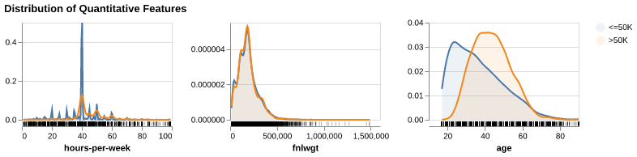
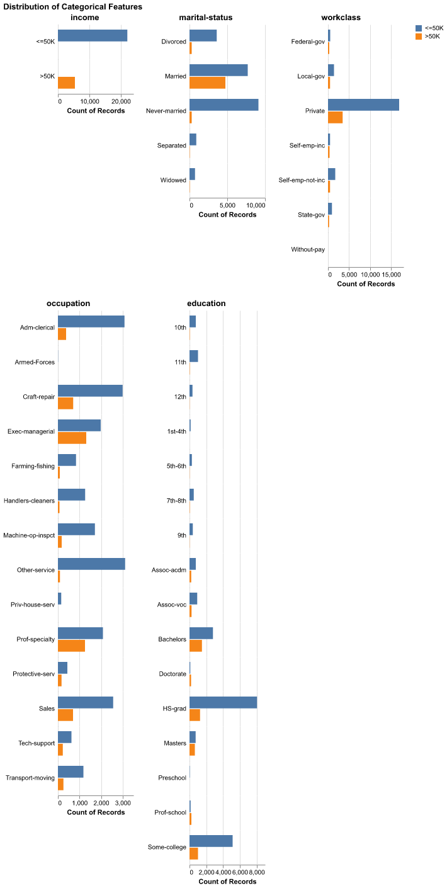
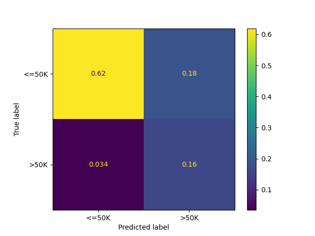
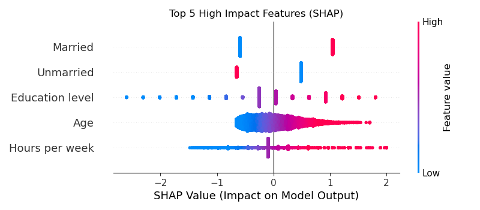

```{python}
#| vscode: {languageId: r}
#imports
import numpy as np
import pandas as pd

income_indicator_score=pd.read_csv("../results/tables/income_indicator_score.csv", index_col=0)
income_indicator_classification_report = pd.read_csv("../results/tables/income_indicator_classification_report.csv", index_col=0).round(3)
```

## Executive Summary

We built a classification model to predict an individual's income group, split by whether they are high earners (> USD 50,000) or low earners (<= USD 50,000). Using a Logistic Regression classifier, our model accuracy was `{python} str(round(income_indicator_classification_report.loc['accuracy', 'precision'],2) * 100) + "%"` on unseen test data with an associated F1 score of `{python} str(round(income_indicator_classification_report.loc['macro avg', 'f1-score'], 2))`. To address the class imbalance in the data, we used a balanced weight approach while buidling our model. We also sought to understand what socioeconomic characterstics play a the biggest role in determining an individuals income group. Using SHAP analysis, our findings show that of the features in our model,  Marital Status, Age & Education are the biggest drivers of a High Income output. 

While the Logistic Regression classifier was chose to easier identify the socioeconomic features that are drivers of high income, we see an opportunity to use an ensemble model such as Random Forest Classification to improve the model's prediction metrics.

## Introduction

How is an individual's income affected by other socioeconomic factors? This is the question our team set out to investigate. Socioeconomic status here is defined as a way of describing people based on their education, income and type of job (@socioeconomic_status). With the diversity of backgrounds that can exist in society, we set out to understand what factors contribute most to an individuals income. 

In this analysis, we use machine learning to predict whether an individuals income is above or below $50,000. As the government sets out massive investment in Canadian societies to improve the lives of citizens(@housing_canada), we envision our analysis as a means of providing insights to the government as to what investments can drive the best chances of improving an individuals life. The persistent income and wealth inequeality increase presents a strong case for prudent investing to improve lives across all Canadians. (@income_inequality)

## Methods

#### Data

For our dataset, we use the Adult dataset sourced from the UC Irvine Machine Learning Repository (@UCI_repo). The dataset contains 14 features obtained from census data to describe an individuals attributes. The target is a categorical column comprised of a binary outcome of whether an individual earns more than USD 50,000(>50K) or USD 50,000 or less (<=50K). 
The data and the descriptions fo the corresponding attributes can be explored using this [link](https://archive.ics.uci.edu/dataset/2/adult)

## Exploratory Data Analysis

Prior to model fitting and feature selection, we first perform EDA to understand the distribution of our features as it relates to our target. 

Below, @tbl-head shows a snip of our dataset, highlighting all the columns, as well as a small portion of the data. 

```{python}
#| label: tbl-head
#| tbl-cap: Snippet of the census data

pd.read_csv("../results/tables/adult_df_head.csv")
```


#### Data Validation Check (Will be deleted)

To ensure the trustworthiness and reproducibility of our analysis, we perform a strict data validation check on the loaded raw data. This validation uses the custom DataValidator class from our **src/validation.py** module to verify critical aspects of the dataset:
- **File integrity** – confirming the file exists and is in the correct format.
- **Structure validation** – ensuring all expected column names and data types are present.
- **Data quality checks** – verifying that missing values are within acceptable limits and that no rows are completely empty.
- **Duplicate detection** – confirming the dataset contains no duplicated observations.
- **Outlier assessment** – checking that extreme values in numerical columns do not distort the analysis.
- **Categorical level verification** – confirming that all categorical features follow the allowed levels defined in the data description.
- **Target distribution check** – ensuring the target/response variable follows an expected distribution.
- **Correlation anomaly detection** – identifying unusually high correlations between the target and numeric features, as well as across features.

**If the data fails any of these checks**, the DataValidationError will be raised, and the **notebook execution will be halted**. This prevents us from proceeding with downstream steps like modeling and visualization using corrupted or unexpected data.

#### Train-Test-Split: Obey the Golden Rule

Before proceeding with further EDA and visualization of the data, we split and stash a test set from our data in order to evaluate our model performance on unseen data in accordance with the pricinples of the Golden rule of machine learning. 


#### Discern Features & Strategize Missing Data (To be Deleted)

With the split, complete we review on the `adult_train` data to understand the statistics of the numerical features and to investigate on the presence of null values.


All null values have been handled during Data Validation.


#### Univariate Distribution of The Quantitative Variables 

*Note - Visualization of the distributions below using the altair-ally python package (@ostblom_altair_ally) is performed with code adapted from UBC's DSCI-573: Feature and Model Selection Course. Reference on the Altair Ally package can be found in using [this external link](https://vega.github.io/altair_ally/intro.html)*

We first investigate the distribution of the dataset's quantitative variables split against the respective income brackets summarized in @fig-quant. From the plots below, we pay special focus on the age distribution of the respondents. Both distributions are right-skewed. Income earners at or below USD 50,000 tend to be younger than fellow respondents earning above USD 50,000. 

Of note also is the age distribution of hours worked per week, with most respondents in both income brackets reporting about 40 hours per week. The `fnlweight` feature is a final numerical value representing the final weight of the record. This value can be viewed as the number of people represented by the row. Without further breakdown on the methods or derivation of this value, we chose to ignore it in our analysis. 

Similarly, no in depth data is provided on the `capital-loss` and `capital-gain` features, but these fields may have strong predictive value for identifying higher-income earners, so we chose to maintain this information, but rather chose to perform binary encoding e.g. any capital-gain above the threshold of zero is encoded as True while all values below zero are encoded as False. This choice was motivated by the need to maintain the information value of the features while smoothing out the noise due to a lack of detailed information from the data's repository. 

{#fig-quant}


#### Univariate Distribution of the Categorical Variables

We also review the distribution of select categorical variables summarized in @fig-categorical

From the first histogram of `income` distribution, we can see that the dataset contains more records of low income earners compared to high income earners, a ration of about 3:1. 

Reviewing the marital status of distribution, we can see that the distribution of high income earners is concentrated primarily on married respondents with scant representation the other marital status groups. Note that the orignal dataset contains 3 distinc married groups: `Married-AF-spouse` for respondents whose partners are in the Army, `Married-civ-spouse` for individuals married to civilian spouses & `Married-spouse-absent`. For simiplification, all values have been combined into one variable `Married`. 

When analysing the `workclass` feature, a feature to classify the respondents' employer, we notice that high income earners are represented primarily in the private sector and less so in other employer categories. 

While the distribution of the `occupation` feature is less conclusive, we see that high income earners in `exec-managerial` and `prof-specialty`, executive management and professional specialties respectively. Likewise when reviewing the `education` feature, we can see that high income earners tend to have at least some college education and are barely present in respondents who did not finish high school (For clarity, 12th grade is the last year of high school) 

In order to prevent propagating inherent societal biases in our model, the following categories are not considered for feature or model selection: `race`. 

Moreover, the `relationship` feature, which represents the relationship the observation has relative to others is not considered as the useful information is encoded within the respondent's marital status. 

We also exclude the `native-country` from our visualization and feature. The overwhelming majority of the respondents are American-born and with little information on other information regarding the foreign-born respondents (e.g. how long they have been in the USA), we exclude this feature from our model. 

{#fig-categorical}


## Features & Model Selection

### Pre-processing pipeline

The adult dataset has various types of features: numeric, categorical, binary.
| Feature | Type | Transformation |
| :--- | :---: | :--- |
| age | Integer | Scaling with StandardScaler |
| workclass | Categorical | imputation, one-hot encoding |
| fnlwgt | Integer | drop |
| education | Categorical | drop |
| education-num | Integer | no transformation needed |
| marital-status | Categorical | one-hot encoding |
| occupation | Categorical | imputation, one-hot encoding |
| relationship | Categorical | drop |
| race | Categorical | drop |
| sex | Binary | one-hot encoding with drop=if_binary |
| capital-gain | Integer | FunctionTransformer - binary flag |
| capital-loss | Integer | FunctionTransformer - binary flag |
| hours-per-week | Integer | Scaling with StandardScaler |
| native-country | Categorical | imputation, one-hot encoding |

: Data features, their corresponding types and the transformations performed


### Model Evaluation

#### Accuracy, Precision, Recall, F1-Score
Our Logistic Regression model demonstrates robust generalization with a test accuracy of `{python} str(round(income_indicator_classification_report.loc['accuracy', 'precision'], 2) * 100) + '%'`, mirroring the cross-validation mean of `{python} str(round(income_indicator_score.loc['test_accuracy', 'mean'], 2)) + '%' `and indicating no overfitting. By employing balanced class weights to address dataset imbalance, the model strategically prioritizes Recall of `{python} round( income_indicator_classification_report.loc['macro avg', 'recall'], 2)` over Precision of `{python} round(income_indicator_classification_report.loc['macro avg', 'precision'], 2) ` for the high-income class (>50K). This configuration results in an F1-score of `{python} round(income_indicator_classification_report.loc['macro avg', 'precision'], 2)`, confirming that while the model successfully identifies the vast majority of high earners, it accepts a higher rate of false positives to ensure potential high-income individuals are rarely missed.


#### Confusion matrix & Classification report
The confusion matrix @fig-confusion as well confirms our high-recall strategy: the model successfully identifies the vast majority of high-income earners (minimizing False Negatives), though this aggressiveness results in more lower-income individuals being incorrectly flagged (higher False Positives).

{#fig-confusion}


We summarize the model performance against some key metrics in @tbl-classification_report below. 

```{python}
#| label: tbl-classification_report
#| tbl-cap: Model performance summary
income_indicator_classification_report
```

### Model Explainability (using SHAP)


### Results:

#### 1. Model Performance:
- **Accuracy:** The model achieved an accuracy of `{python} print("This is a placeholder for our  test accuracy score. I need a table in the results repository that I can index to read the test score and post here." )` on the test set.
- **Class Imbalance Handling:** By using class_weight='balanced', we prioritized identifying high-income earners (>50K). This likely resulted in higher Recall for the >50K class (catching more high earners) potentially at the cost of some Precision (more false positives).
- **Confusion Matrix Analysis:** As seen in the matrix, the model correctly identified high-income individuals, while missing some False positives.

#### 2. Feature Importance (Explainability)
We used SHAP values,summarized in @fig-shap, to interpret the model's decisions by assigning an 'importance score' to every feature for every prediction. This allows us to see exactly which factors pushed a specific individual's prediction towards the high-income or low-income category, ultimately helping us understand the key factors that predict an individuals income. 

- **Marital Status:** Being Married-civ-spouse is often the strongest positive predictor of high income (indicated by the long red bar pushing to the right in the SHAP plots).
- **Age:** The dependence plot shows a positive correlation between age and income up to a certain point (likely 50-60 years old), after which it may plateau or decrease.
- **Education:** Higher education-num consistently pushes predictions toward the >50K category.
- **Hours per week:** Individuals investing more hours per week are overwhelmingly classified as high income.

{#fig-shap}


### Conclusion

This analysis successfully established a robust predictive model for income classification, leveraging logistic regression to identify the key drivers of economic disparities. By intentionally designing a pipeline that addresses class imbalance, our model demonstrates a high sensitivity to detecting high-income earners, ensuring that significant predictors of wealth are not overlooked. While we prioritized ethical fairness by excluding explicit racial and relationship identifiers, the model’s performance confirms that other structural factors—specifically education, marital status, and career stability—remain powerful proxies for economic success in the current landscape.

From a socioeconomic perspective, our results align closely with established economic theory. **Education** emerged as a dominant differentiator, validating the concept of human capital where higher investment in skills directly correlates with earning potential. Similarly, **Marital Status** proved to be a substantial predictor, likely reflecting the economic stability often associated with dual-income households or the "marriage premium" phenomenon observed in labor economics. **Age** also displayed a strong positive trend, illustrating the natural accumulation of experience and seniority over a career trajectory, though this effect naturally plateaus as individuals near retirement.

### References


